# 🩺 BuildDoctor

> **If you can build it, BuildDoctor can help you ship it.**

**BuildDoctor** is an AI-powered DevOps agent designed to bridge the gap between **application development and cloud deployment**.

A developer can build an application successfully, but getting that application from a GitHub repository to a **verified, working AWS deployment** often requires a completely different set of DevOps skills.

BuildDoctor aims to make that journey dramatically simpler.

---

## 1. 🎯 The Problem

Many developers can build:

- React / Next.js applications
- Node.js / Express APIs
- Python / FastAPI applications
- Django applications
- Go services
- Database-backed applications

But deployment introduces another layer of complexity:

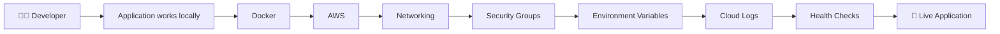

The developer suddenly needs to understand Docker, Linux, cloud infrastructure, networking, registries, deployment configuration, logs, and troubleshooting.

### The core problem

> **Building an application and deploying an application are two different skill sets.**

BuildDoctor exists to bridge that gap.

---

# 2. 💡 The Core Idea

The user provides a GitHub repository and the required deployment configuration.

BuildDoctor handles the deployment journey.

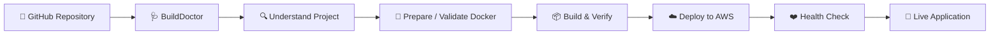

The ideal experience is:

```text
GitHub Repository
       ↓
   BuildDoctor
       ↓
Understand the Project
       ↓
Validate / Prepare Docker Setup
       ↓
Build & Verify
       ↓
Deploy to AWS
       ↓
Health Check
       ↓
    🚀 LIVE
```

If something fails:

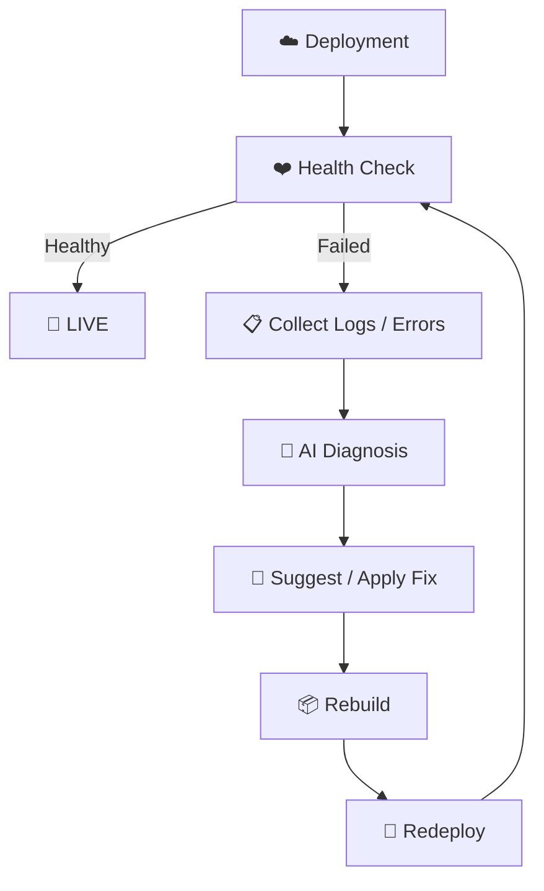

---

# 3. 🩺 What Exactly Is BuildDoctor?

BuildDoctor is **not just an AI Dockerfile generator**.

It is **not just a CI/CD log analyzer**.

It is **not just an AWS deployment script**.

It combines these capabilities into one deployment-oriented agent.

### BuildDoctor's job

> **Understand the application → prepare it for deployment → deploy it → verify it → diagnose failures → recover when possible.**

---

# 4. 👤 What Does the User Provide?

At the beginning, BuildDoctor collects the information required to safely perform the deployment.

## Repository

- GitHub repository URL
- Branch to deploy
- GitHub authentication/access if the repository is private

### Repository access

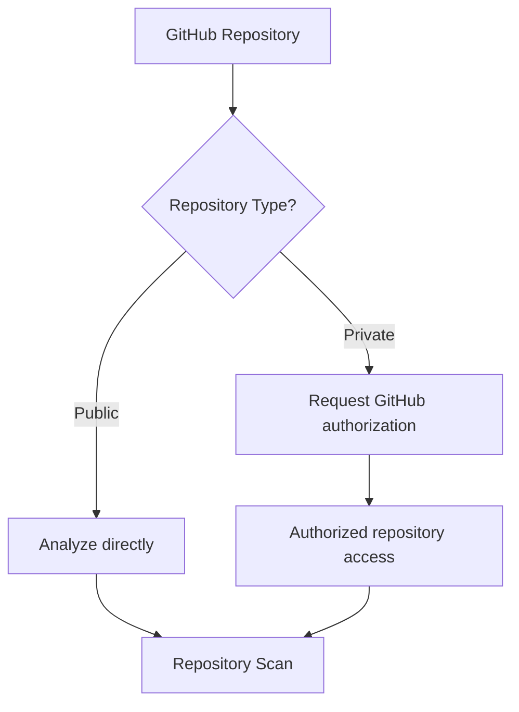

A public repository can be analyzed directly.

A private repository requires appropriate authorization.

---

# 5. ☁️ AWS / Deployment Configuration

The user can provide or select:

- AWS account/profile
- AWS region
- Deployment target
- Existing EC2 instance **or** permission to create one
- Existing Security Group **or** permission to create one
- Instance type preference
- Application/network port
- Environment variables / secrets where required

The important principle is:

> **The AI should understand the deployment, but the user should remain in control of important infrastructure decisions.**

---

# 6. 🔍 Repository Understanding

Before changing or deploying anything, BuildDoctor should understand what it is dealing with.

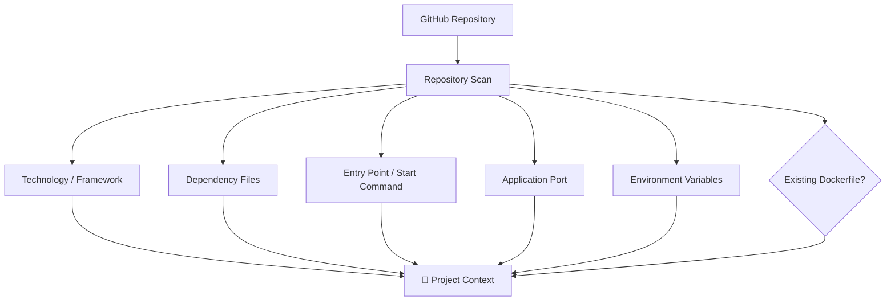

### Examples

**Technology / Framework**

```text
Node.js
Express
Next.js
React
Python
FastAPI
Django
Go
```

**Dependency files**

```text
package.json
requirements.txt
pyproject.toml
go.mod
```

**Entry points**

```text
npm start
python app.py
uvicorn main:app
gunicorn app:app
```

**Ports**

```text
3000
5000
8000
8080
```

BuildDoctor should identify these as part of the project's deployment context.

---

# 7. 🐳 Existing Dockerfile Intelligence

One of the most important rules:

> **BuildDoctor should not blindly overwrite an existing Dockerfile.**

First, it checks whether the repository already has Docker configuration.

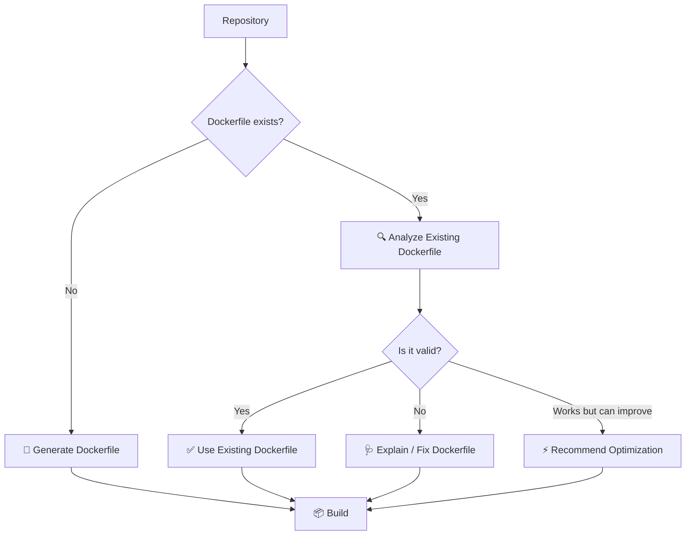

## Case 1 — No Dockerfile

```text
Repository
    ↓
No Dockerfile
    ↓
Understand project
    ↓
Generate Dockerfile
```

## Case 2 — Dockerfile is valid

```text
✓ Dependencies make sense
✓ Start command is correct
✓ Port configuration matches
✓ Image builds successfully

→ Use existing Dockerfile
```

## Case 3 — Dockerfile is broken

```text
❌ Wrong dependency
❌ Wrong start command
❌ Wrong port

→ Explain the problem
→ Suggest / apply correction
→ Build again
```

## Case 4 — Dockerfile works but is inefficient

```text
✓ Application works

⚠ Image is unnecessarily large
⚠ Development dependencies included
⚠ Build layers could be optimized

→ Recommend improvements
```

Initially, optimization should be presented as a recommendation rather than silently replacing the user's working setup.

---

# 8. 📦 Build Validation

Before deployment, BuildDoctor should verify that the application can actually be built and started.

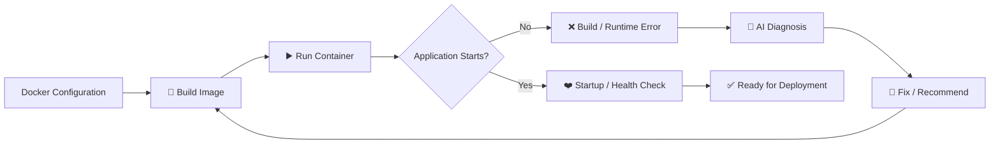

A successful Docker build alone is not enough.

BuildDoctor should verify that the application actually starts and responds as expected.

---

# 9. ☁️ AWS Deployment

Once the application is ready, BuildDoctor handles the cloud deployment workflow.

The initial deployment target can be kept simple:

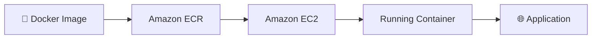

BuildDoctor may work with:

- Existing EC2 instances
- Newly created EC2 instances
- Existing Security Groups
- Newly created Security Groups
- ECR repositories

The developer should not need to manually perform every AWS console step.

---

# 10. 🚀 End-to-End Deployment Journey

This is the central BuildDoctor workflow.

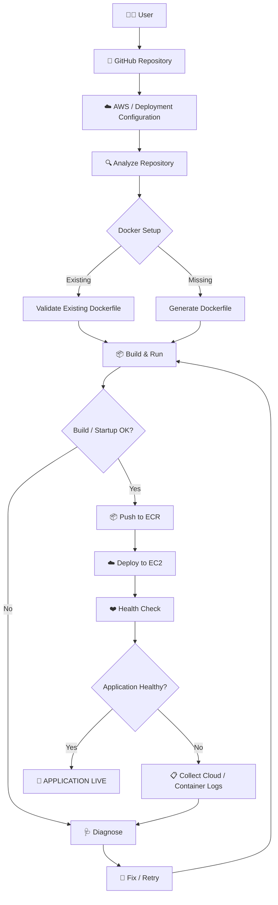

---

# 11. ❤️ Deployment Verification

Deployment is not considered successful merely because the container started.

BuildDoctor should verify:

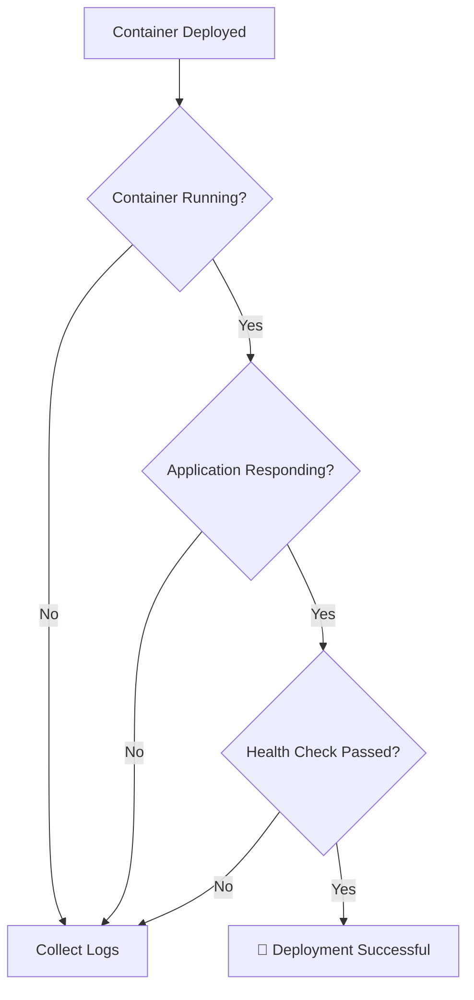

A successful deployment could result in:

```text
🚀 Deployment Successful

Application:
https://example.com

Status:
Healthy

BuildDoctor verified:

✓ Container running
✓ Application responding
✓ Health check passed
```

---

# 12. 🧠 AI Failure Diagnosis

This is where BuildDoctor becomes more than a deployment automation tool.

Deployment failures can happen because of:

- Wrong port
- Missing dependency
- Incorrect start command
- Missing environment variable
- Dockerfile error
- Application crash
- Permission problem
- Container exits immediately
- Security Group configuration
- Insufficient resources
- Application starts but cannot be reached

Instead of:

```text
Deployment Failed
```

BuildDoctor should investigate.

---

# 13. 🩹 The BuildDoctor Feedback Loop

The central agentic behavior can be represented as:

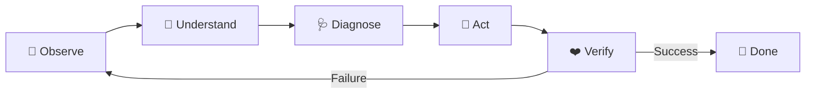

### Example

```text
Deployment
    ↓
❌ Health Check Failed
    ↓
Collect logs
    ↓
Analyze application state
    ↓
Identify root cause
    ↓
Apply / suggest fix
    ↓
Rebuild
    ↓
Redeploy
    ↓
Health Check
```

If successful:

```text
✓ Application recovered
```

If not:

```text
BuildDoctor explains:

Root Cause:
...

Evidence:
...

Attempted Fix:
...

Result:
...

Recommended Next Step:
...
```

---

# 14. 🧪 Example Scenario

Imagine a developer has a Node.js application.

They provide:

```text
GitHub:
github.com/user/my-app
```

BuildDoctor analyzes it:

```text
Project Analysis
────────────────────────

Framework: Express
Runtime: Node.js
Entry Point: server.js
Port: 3000

Dockerfile:
Found existing Dockerfile

Dockerfile Status:
Valid

Deployment Target:
AWS EC2
```

The application is built and deployed.

But the application fails to start.

The logs contain:

```text
Error: Cannot find module 'express'
```

BuildDoctor reasons:

```text
Root Cause:
express is imported by the application but is missing
from the production dependencies.

Evidence:
Application imports express.
Package dependencies do not contain the required package.
```

It proposes a fix.

After the fix:

```text
✓ Build successful
✓ Image created
✓ Image deployed
✓ Container running
✓ Health check passed

🚀 Your application is live.
```

---

# 15. 🛡️ Safety and User Control

BuildDoctor should not blindly make destructive cloud changes.

Important infrastructure operations should have approval gates when appropriate.

For example:

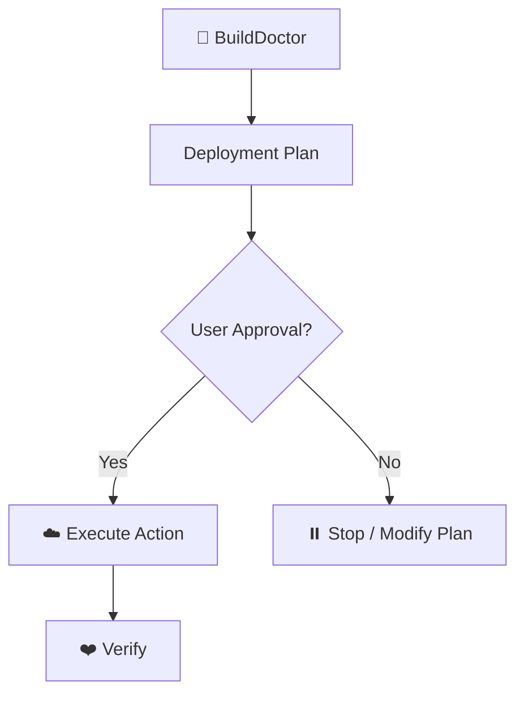

Example:

```text
BuildDoctor wants to:

Create a new EC2 instance
Create a Security Group
Create an ECR repository

Proceed?

[Y/n]
```

Destructive actions such as terminating infrastructure should require explicit confirmation.

---

# 16. 🖥️ Ideal User Experience

The goal is to hide unnecessary DevOps complexity.

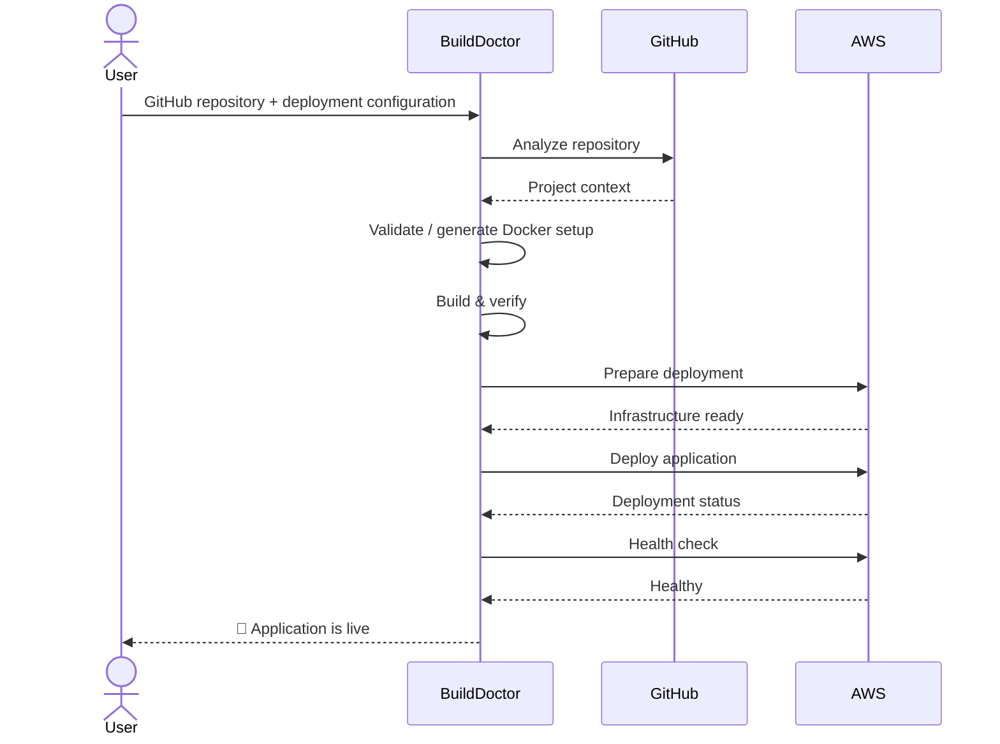

The user should feel like:

> **"I gave it my project, and it took care of deployment."**

---

# 17. 🧩 BuildDoctor Capabilities

BuildDoctor can be thought of as four major capabilities:

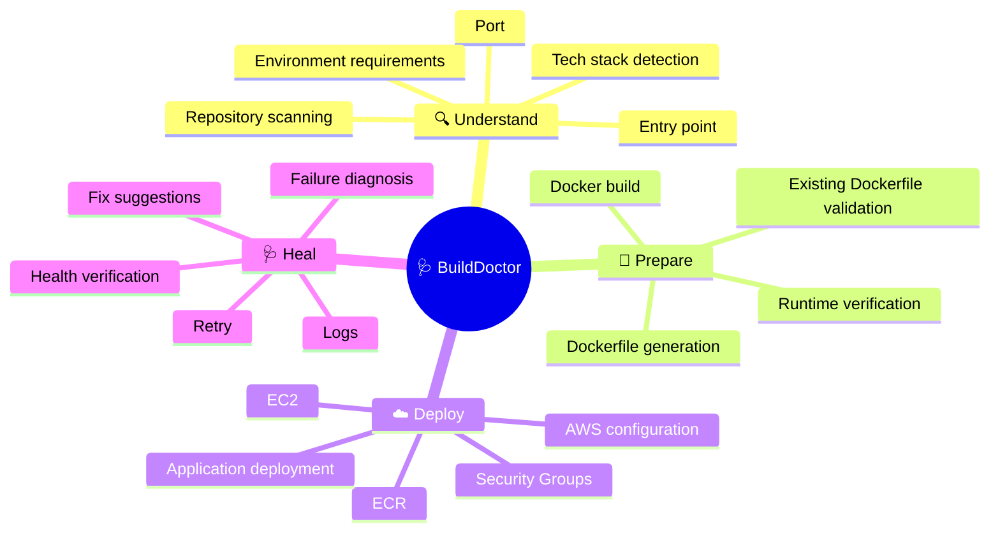

---

# 18. 🔥 Why This Is Different

## Not just an AI Dockerfile Generator

Because BuildDoctor also:

```text
Understand
   ↓
Build
   ↓
Deploy
   ↓
Verify
```

## Not just a CI/CD Log Analyzer

Because it starts from the application repository and handles the deployment journey.

## Not just an AWS deployment script

Because it understands the application and can reason about failures.

### The larger idea

> **BuildDoctor is the bridge between application development and application deployment.**

---

# 19. 🚧 MVP Scope

The first version should remain focused.

### MVP supports

- GitHub repositories
- Public repositories first
- Node.js applications
- Python applications
- Existing Dockerfile detection
- Dockerfile generation when missing
- Docker build validation
- AWS ECR
- AWS EC2
- Basic Security Group configuration
- Application health checks
- Deployment logs
- AI failure diagnosis
- Basic fix/retry loop

### MVP goal

> **GitHub repository → verified application running on AWS**

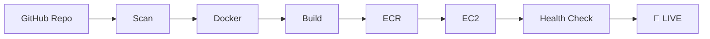

---

# 20. 🔮 Future Expansion

Once the core workflow is stable, BuildDoctor can expand.

## More languages and frameworks

```text
Go
Java
Django
FastAPI
Next.js
Spring Boot
```

## More deployment targets

```text
ECS
EKS
Kubernetes
Serverless containers
```

## More intelligent remediation

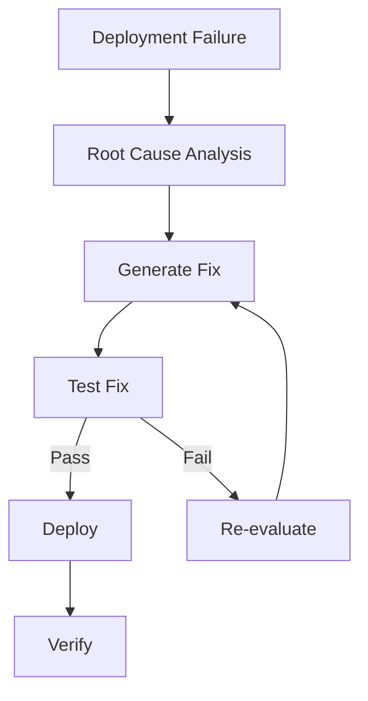

## CI/CD integration

The original AI CI/CD Log Analyzer idea can become another BuildDoctor capability:

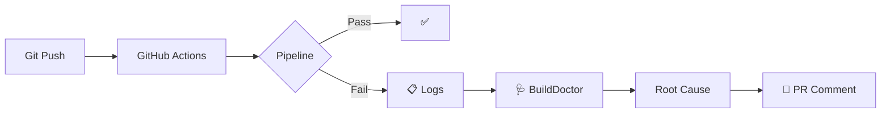

This means BuildDoctor can eventually help both **before deployment** and **after deployment**.

---

# 21. 🌐 Long-Term Vision

The long-term vision is not:

> "AI that writes Dockerfiles."

It is:

> **An AI DevOps agent that takes an application from source code to a verified cloud deployment.**

The developer should not need to be an expert in:

- Docker
- Linux deployment
- AWS
- Networking
- Container registries
- Deployment configuration
- Cloud troubleshooting

BuildDoctor handles the operational complexity while keeping the developer informed and in control.

---

# 22. 🏷️ One-Line Product Definition

> **BuildDoctor is an AI-powered DevOps agent that takes a GitHub repository, understands the application, prepares and validates its container setup, deploys it to AWS, verifies that it is live, and diagnoses or fixes deployment failures.**

---

# 23. ❤️ The Core Philosophy

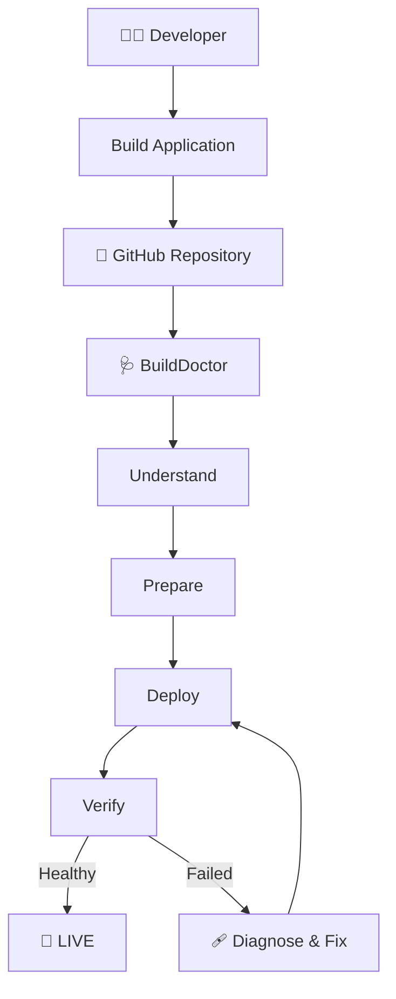

### Developers build the application.

### BuildDoctor gets it deployed.

> **If you can build it, BuildDoctor can help you ship it.**
