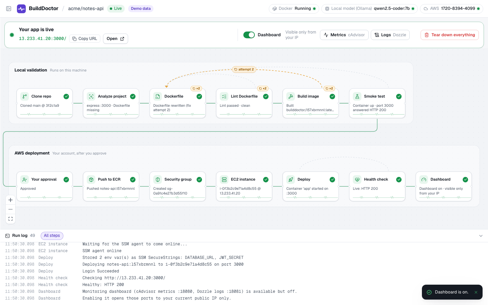
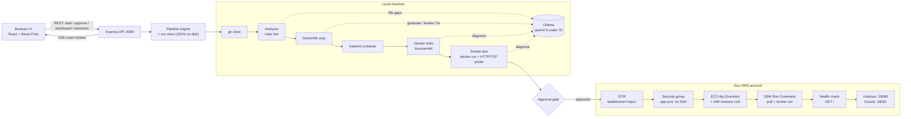
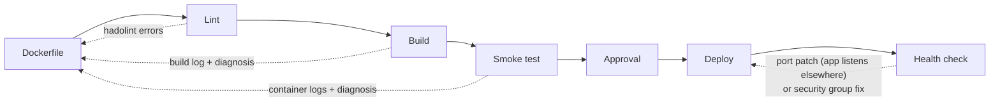
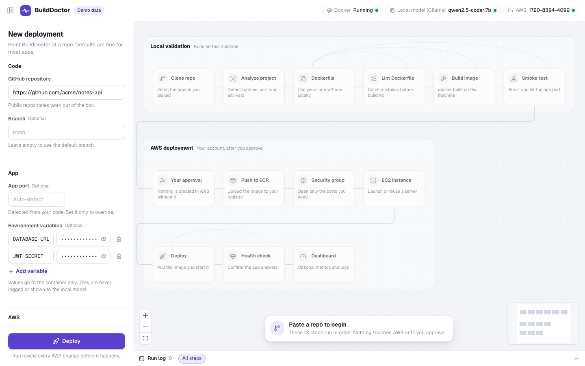
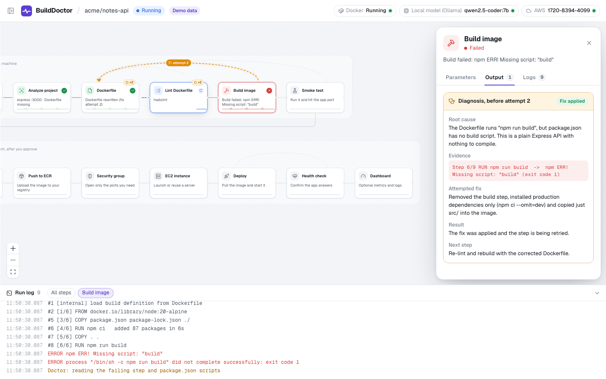
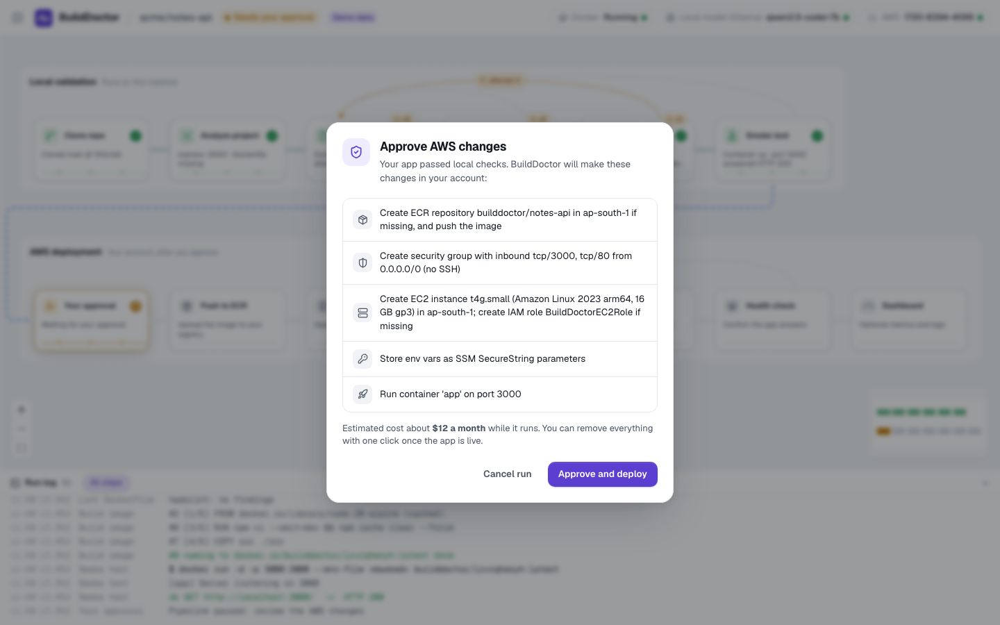
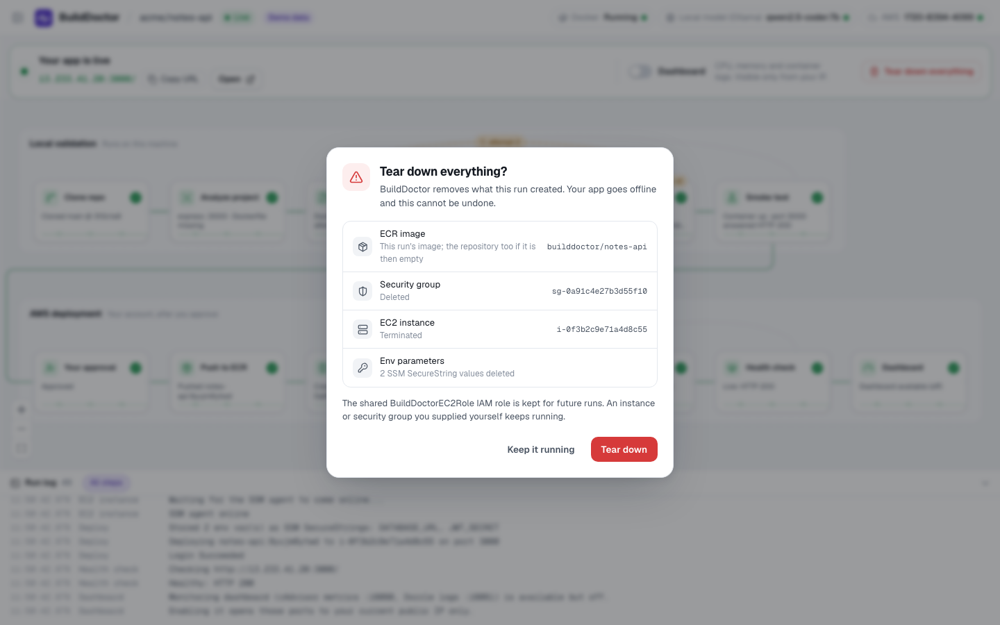

# BuildDoctor

Paste a GitHub repo URL; BuildDoctor containerises it, checks that it runs on your machine, then deploys it to an EC2 instance in your AWS account once you approve. When a step fails, it diagnoses the error and retries.


*A finished run: local validation on top, AWS deployment below, and a doctor-loop retry shown as the dashed edge (demo mode).*

## What it does

Every run goes through the same 13 steps:

1. **Clone repo**: shallow `git clone` of the repo and branch into `workspaces/<runId>/repo`.
2. **Analyze project**: detect runtime (Node.js, Python, Go), framework, start command, port, env var names and dependency files. Detection is rule-based first; the local model (Ollama) fills in only what the rules could not find.
3. **Dockerfile**: generate one, keep the existing one, or rewrite it after a failure (see [the four Dockerfile cases](#existing-dockerfile-the-four-cases)).
4. **Lint Dockerfile**: run `hadolint` in its own container. Error-level findings send the run back to step 3.
5. **Build image**: `docker build` for `linux/arm64` via the Docker Engine API.
6. **Smoke test**: run the image locally and wait up to 30 s for the port to answer HTTP (or hold a TCP connection for non-HTTP services).
7. **Your approval**: the pipeline pauses and shows the exact AWS changes it will make. Nothing touches AWS before this.
8. **Push to ECR**: create the repository `builddoctor/<repo-name>` if it is missing, then push the image tagged with the run id.
9. **Security group**: create one in the default VPC with the app port open (or reuse one you tagged). Port 22 is never opened.
10. **EC2 instance**: launch a t4g instance (Amazon Linux 2023, arm64, 16 GB gp3) with the BuildDoctor IAM instance role, or reuse one you tagged. Then wait for the SSM agent to come online.
11. **Deploy**: store env vars as SSM SecureStrings, then use SSM Run Command to pull the image and start the container `app`.
12. **Health check**: poll `http://<public-ip>:<port>/` for up to 90 s. On failure, collect `docker ps`, container logs and listening sockets over SSM and diagnose.
13. **Dashboard**: an optional cAdvisor (metrics) + Dozzle (logs) pair on the instance, off by default and switched on from the UI.

## Architecture



The server (`server/`) holds all state and does all the work. The web app (`web/`) is a view on the run's event stream: every node status, log line, retry and approval request arrives as a server-sent event, and reconnecting replays the full history. The UI and the server share one contract file, `server/src/types.ts`.

### The doctor loop



- A failing lint, build or smoke test sends execution back to the Dockerfile step. The model gets the failure log, its own diagnosis and every earlier attempt, and returns a corrected Dockerfile. The result is checked before use: it needs `FROM`, `CMD`/`ENTRYPOINT` and `EXPOSE <port>`, every `COPY` source must exist, and it must differ from the Dockerfile that just failed.
- A failing health check can loop back to Deploy in two cases. Either the security group (one this run created) was missing the port, or the container logs show the app listening on a different port. In the second case the engine applies a config patch. The patch is whitelisted to `appPort` only and rejects port 22 and no-op changes.
- If the app needs an env var that was not provided, the run stops and asks for it. We never invent env values.
- Each loop target gets at most `maxFixAttempts` retries (default 3). After that, the run ends with a root-cause report: root cause, evidence, attempted fix, result and next step.

## Key design decisions

- **Local model.** All model calls go to Ollama on your machine, so no code leaves it. Only file names, dependency manifests, the Dockerfile and log tails are ever put in a prompt.
- **Build and test before cloud.** Lint, build and a real `docker run` smoke test must pass locally before anything is created in AWS.
- **Human approval gate.** The run pauses and lists the exact AWS changes. Declining ends the run with nothing created.
- **SSM instead of SSH.** Deploys, diagnostics and the dashboard all go through SSM Run Command. Port 22 is never opened; it is filtered out of the requested ports and rejected in config patches.
- **arm64 / Graviton.** Images build natively on Apple Silicon and run as-is on t4g instances, with no cross-compiling.
- **Least-privilege IAM.** The deploy user's policy is tag-scoped to `Project=BuildDoctor`: destructive EC2 actions, ingress changes and `ssm:SendCommand` only work on tagged resources, and ECR access is limited to `builddoctor/*` repositories. The instance role can read only `/builddoctor/*` parameters, plus the SSM agent essentials and ECR read-only.
- **Env values stay secret.** Values are masked out of logs and prompts and redacted from API responses. They are stored as SSM SecureStrings and fetched on the instance, so they never appear in SSM command history.
- **Dashboard locked to your IP.** The cAdvisor and Dozzle ports open to the caller's public `/32` only, and stale IPs are revoked when it is re-enabled.
- **Runs survive restarts.** Each run is persisted to `workspaces/runs/<id>.json`. A run cut off by a restart is marked failed but keeps its record of created resources, so teardown still works.
- **No CI minutes.** Clone, analysis, model calls, lint, build and smoke test all run locally. The only cloud spend is the resources you approve.

## Existing Dockerfile: the four cases

| Case | What BuildDoctor does |
|---|---|
| **1. No Dockerfile** | The model generates one under fixed rules: slim base image, manifests copied before source, non-root user, `EXPOSE`, exec-form `CMD`. A missing non-root `USER` is added automatically. Each attempt is validated; after 3 rejected attempts (or if Ollama is down) we fall back to a built-in template for Node, Python or Go. A `.dockerignore` is written if none exists. |
| **2. Existing and valid** | The file is kept unchanged. The model reviews it against the detected project (dependencies, start command, port, image size) and the review appears in the step's output. |
| **3. Existing but broken** | It is still kept at first, and the review flags the problems. When lint, build or smoke test then fails, the doctor loop rewrites it from the failure log. The original is kept as `Dockerfile.original` beside it for the rest of the run. |
| **4. Works but could be better** | The review can include an optimised Dockerfile and suggestions. They are shown for you to apply yourself and never applied automatically. |

## Prerequisites

- macOS or Linux. On an x86 host, arm64 builds run under QEMU emulation, which is slower.
- Node.js 22 (22.9 or newer, for `--env-file-if-exists`).
- Docker Desktop (or another Docker Engine), running.
- Ollama with the model pulled:

  ```bash
  ollama pull qwen2.5-coder:7b
  ```

- AWS credentials in `~/.aws` (a named profile or the default chain).

> Use a dedicated IAM user with [`docs/iam/deploy-user-policy.json`](docs/iam/deploy-user-policy.json) attached. Do not use root credentials. The top bar checks the policy on startup and warns if actions are missing. [`docs/iam/instance-role-policy.json`](docs/iam/instance-role-policy.json) is the policy BuildDoctor puts on the EC2 role; you do not need to create it yourself.

The account also needs a default VPC in the region you deploy to, unless you supply your own security group.

## Quick start

```bash
npm install
cp .env.example .env      # set AWS_PROFILE; the other defaults usually work
npm run dev               # server on :4000, web on :5173
```

Open <http://localhost:5173>.

To try the UI without Docker, Ollama or AWS, open <http://localhost:5173/?mock=1>. This demo mode replays a scripted run, including a retry, the approval prompt, the dashboard and teardown. Add `&step=retry`, `&step=approval` or `&step=live` to jump to a checkpoint.

`.env` settings:

| Variable | Default | Used for |
|---|---|---|
| `AWS_PROFILE` | SDK default chain | Credentials profile for every AWS call |
| `AWS_REGION` | `us-east-1` | Startup account and permission check only; each run picks its own region in the form |
| `OLLAMA_URL` | `http://localhost:11434` | Ollama endpoint |
| `OLLAMA_MODEL` | `qwen2.5-coder:7b` | Model used for analysis, Dockerfiles and diagnosis |
| `PORT` | `4000` | API server port (the Vite dev proxy expects 4000) |

## Using it

**1. Start a run.** The top bar shows whether Docker, the local model and AWS are reachable. In the form, paste a repo URL and optionally set the branch, app port, env vars, region, instance size, extra ports, or an existing instance or security group. To be reused, an existing instance or security group must be tagged `Project=BuildDoctor`, and an instance must also be arm64 and SSM-managed.


*The 13 steps before a run starts (demo mode).*

**2. Watch it work, and fix itself.** Click any node for its parameters, output and logs. When a step fails, the dashed edge shows where execution went back to, and the inspector shows the diagnosis that drove the fix.


*The build failed on a missing `build` script; the Dockerfile was rewritten and the run is on attempt 2 (demo mode).*

**3. Approve the AWS changes.** After the smoke test passes, the run pauses on a list of exactly what will be created, with a rough monthly cost. If you cancel, nothing is created.


*The approval gate (demo mode).*

**4. Use the live app.** When the health check passes you get the URL. The dashboard toggle starts cAdvisor and Dozzle on the instance and opens their ports to your IP only.


*Live, with the metrics and logs dashboard on (demo mode).*

**5. Tear it down.** One click removes what this run created.


*Teardown lists each resource before deleting (demo mode).*

## Teardown

Teardown only touches resources this run recorded as created, and re-checks their `Project`/`RunId` tags before deleting.

**Deleted**
- The EC2 instance it launched (terminated, including its volume).
- The security group it created.
- Ingress rules it added to a security group you supplied.
- The run's image tag in ECR, and the ECR repository if this run created it and it is now empty.
- The run's SSM SecureString env parameters.
- On an instance you supplied: the dashboard containers and their ingress rules.

**Kept**
- The shared `BuildDoctorEC2Role` IAM role and instance profile, which later runs reuse.
- An instance or security group you supplied. The `app` container on your instance keeps running.
- An ECR repository that still holds images from other runs.

When a run ends, the local image and the cloned workspace are removed automatically, with or without teardown.

## Testing

```bash
npm test                      # vitest, server workspace
npm run typecheck -w server
npm run lint -w web
```

- **Unit and integration tests** (`server/test/*.test.ts`, `server/test/aws/*.test.ts`) cover:
  - deterministic analysis and Dockerfile validation
  - the engine (ordering, retries, patches, approval, terminal states)
  - store persistence
  - the HTTP API
  - every AWS step, with the AWS SDK mocked (`aws-sdk-client-mock`), including the IAM policy docs and teardown

  No Docker, Ollama or AWS account is needed for these.
- **End-to-end** (`server/test/e2e.local.test.ts`) runs the real local pipeline (analyze, Dockerfile, lint, build, smoke) against the fixtures in `server/test/fixtures/`: a working Express app, a broken Express app and a FastAPI app. It needs Docker and Ollama with the model pulled, and is skipped automatically when either is missing. It never calls AWS.

- **Live deploy.** We ran the full pipeline against [`heroku/node-js-getting-started`](https://github.com/heroku/node-js-getting-started) on a `t4g.micro` in `ap-south-1`. All 13 steps passed on the first attempt; the app, cAdvisor and Dozzle all answered HTTP 200, and teardown removed the instance, security group and ECR repository.

## Project structure

```text
BuildDoctor/
├── package.json               npm workspaces: server, web; `npm run dev` starts both
├── .env.example
├── BuildDoctor_Project_Concept.md
├── docs/
│   ├── VISION.md              original concept write-up
│   ├── iam/
│   │   ├── deploy-user-policy.json
│   │   └── instance-role-policy.json
│   └── screenshots/
├── server/
│   ├── src/
│   │   ├── index.ts           Express API, SSE, local health + permission probe
│   │   ├── types.ts           shared contract (pipeline, events, run state)
│   │   ├── pipeline/          engine (order, doctor loop, approval), step interface, run store
│   │   ├── steps/             clone, analyze, dockerfile, lint, build, smoke, approve
│   │   ├── aws/               ecr, network (security group), ec2, deploy, health, dashboard, teardown, ssm
│   │   └── llm/ollama.ts      the only place the model is called
│   └── test/                  unit, mocked-AWS and local e2e tests + fixtures
├── web/
│   └── src/
│       ├── App.tsx
│       ├── api.ts, mock.ts    real backend client and the ?mock=1 demo backend
│       └── components/        Canvas (React Flow), Inspector, Console, RunForm, Dialogs, ...
└── workspaces/                (gitignored) cloned repos and persisted runs
```

## Cost notes

These are approximate on-demand prices (us-east-1, about 730 hours a month). Other regions differ a little.

| Instance | vCPU / RAM | Compute per month |
|---|---|---|
| `t4g.micro` | 2 / 1 GB | ~$6 |
| `t4g.small` | 2 / 2 GB | ~$12 |
| `t4g.medium` | 2 / 4 GB | ~$25 |

On top of the compute:
- the 16 GB gp3 root volume, about $1.30 a month
- the instance's public IPv4 address, about $3.60 a month
- ECR storage, about $0.10 per GB-month

SSM Run Command and standard SecureString parameters cost nothing extra. Everything is billed only while it exists, so tear down when you are done.

## Limitations and future work

- **State is in memory plus JSON files.** There is no database, a single server process, and runs cannot resume after a restart; an interrupted run can only be torn down.
- **One EC2 instance per run.** There is no load balancer, autoscaling, ECS/EKS, or zero-downtime redeploy.
- **Health checks only probe `GET /`.** Any status below 500 counts as healthy; there is no configurable health path.
- **HTTP only.** There is no TLS, domain or reverse proxy; the app is served on `http://<public-ip>:<port>/`.
- **The dashboards have no authentication.** cAdvisor and Dozzle are protected only by the `/32` IP allowlist.
- **The model is small.** A 7B model sometimes writes Dockerfiles that fail validation or misdiagnoses a failure. The validator, the built-in templates and the retry cap limit the damage, but some repos will still need a manual fix.
- **Repos must be public.** Cloning never prompts for credentials, so private repos need credentials embedded in the URL.
- **Limited stack support.** We detect Node.js, Python and Go services only, and the app must sit at the repository root.
- **The app port is public.** The app port, and any extra ports you request, are opened to `0.0.0.0/0`.
- **The doctor loop only fixes some failures.** It can rewrite the Dockerfile or remap the port. It never edits application code and never invents env values.

---

Concept: see [docs/VISION.md](docs/VISION.md).
